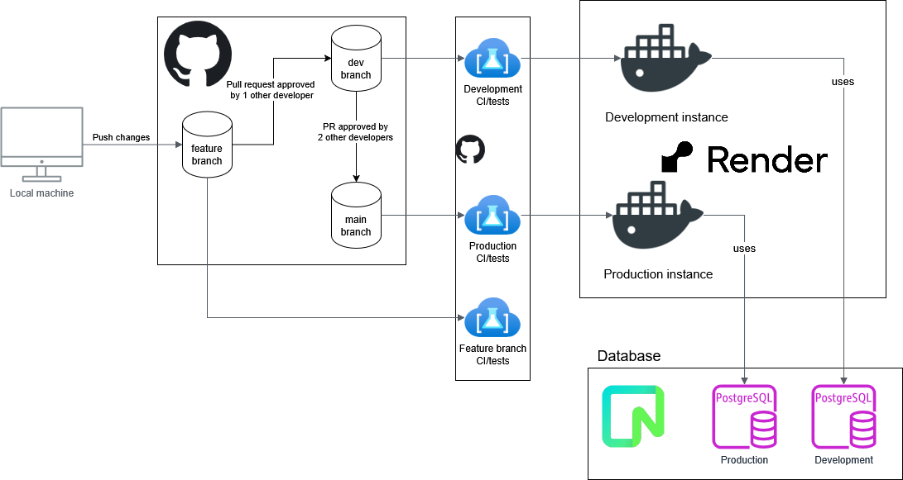

# Architecture

L'architecture est décomposée en plusieurs parties.

## Backend

Ici nous avons la partie Backend. Le GitHub reçoit les changements qui seront analysés par GitHub actions. Cette structure est déjà séparée entre la partie **main** et **dev**, respectivement la partie *production* et *développement*.

Nous avons ensuite 2 environnements Render qui ont chacune une instance de base de donnée PostgreSQL provenant de l'application Neon. C'est cet environnement Render qui sert de serveur, et qui contient notre landing page.

## Frontend

FIXME
