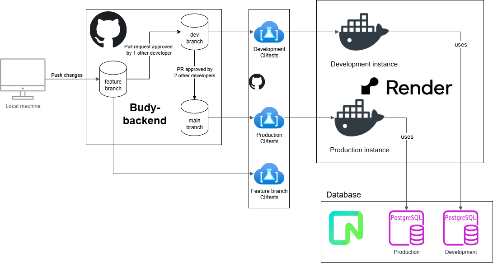
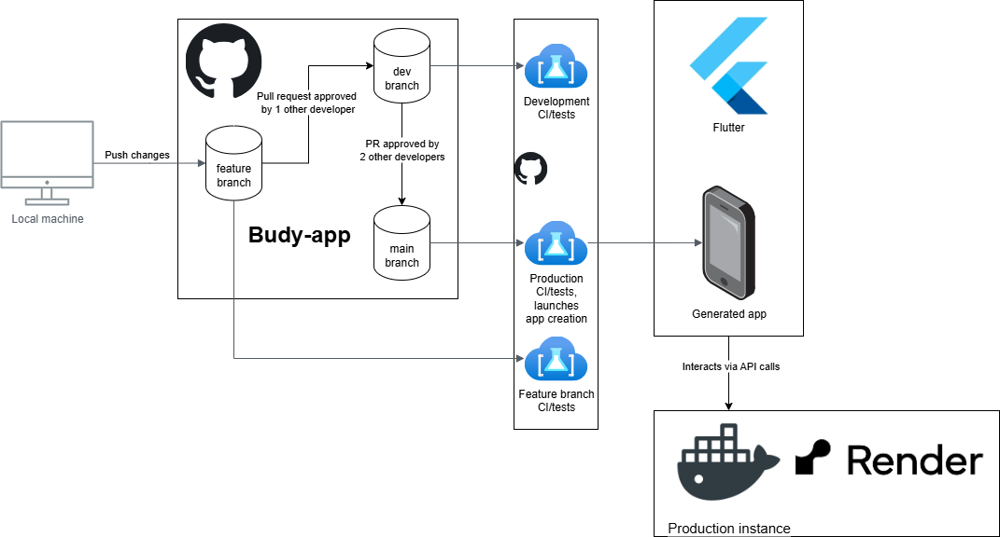

# Architecture

L'architecture est décomposée en plusieurs parties.

## Backend

Ici nous avons la partie Backend. Le GitHub reçoit les changements qui seront analysés par GitHub actions, qui vérifie donc que nous sommes conformes à nos requirements, et que nos tests passent (les tests se trouve dans un dossier `./tests` dans le dépôt GitHub `budy-backend`).

Nous avons ensuite 2 environnements Render qui ont chacune une instance de base de donnée PostgreSQL provenant de l'application Neon. C'est cet environnement Render qui sert de serveur, et qui contient notre landing page. C'est aussi Render qui s'occupe directement d'aller faire le déploiement continu. Il surveille une branche et quand un changement qui passe les tests est fait, il applique le changement.

De la sorte, la partie GitHub est déjà séparée entre la partie **main** et **dev** (les branches), qui correspondent respectivement à la partie *production* et *développement* de Render et Neon.

## Frontend

Ici nous avons la partie Frontend, l'application. La structure est similaire à celle de la Backend. GitHub reçoit les changements, toujours analysés par les GitHub actions. Ces dernières font les tests (les tests se trouve dans un dossier `./test` dans le dépôt GitHub `budy-app`)

Une fois les tests faits et passés, on se retrouve dans deux cas de figure. Si ce changement a eu lieu dans `main` (après le merge depuis la branche `dev`), alors une release sera créée. Sinon, seuls les tests seront faits, et il n'y aura pas de release. Nous n'avons donc pas d'application déloyée automatiquement pour les tests de développement, ceux-ci seront faits à la main.
