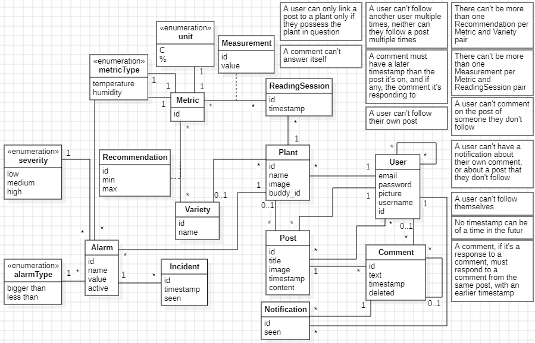

# Budy

## Introduction

### Problème

Difficulté à bien s’occuper de ses plantes sans pouvoir visualiser leur environnement de vie, détecter des irrégularités dans cet environnement, ou avoir des personnes vers qui se tourner pour demander des conseils.

### Solution

À l’aide d’une application mobile, suivre l’environnement de ses plantes, visualiser son évolution au cours du temps, et configurer des alertes déclenchées par des anomalies dans cet environnement afin d’améliorer la surveillance. Pouvoir en discuter directement avec sa famille, ses amis ou ses connaissances de manière centralisée sur l’application, avec les données disponibles si souhaité (pour donner/demander des conseils, ou simplement avoir un sujet de discussion commun).

### Notre produit

**Budy** est notre mise en œuvre de cette solution.  
C’est une application qui agit à la fois comme un réseau social et comme un outil de surveillance, permettant aux utilisateurs de connaître l’état de l’environnement de leurs plantes grâce à un système de capteurs physiques. En utilisant ces données, ils peuvent savoir comment mieux prendre soin de leurs plantes et, en cas de doute, demander conseil à d’autres utilisateurs via des publications dans la communauté.

## Auteurs

Groupe 9 :

- Vuilleumier Thomas
- Diaz Sebastian
- Richard Aurélien
- Chollet Florian

## Documentation

- [Exigences du projet](../REQUIREMENTS.md)
- [Processus de contribution](../CONTRIBUTING.md)

## Comment accéder à notre produit

### Page de présentation

Lien vers la landing page : [Landing Page](https://budy-kio5.onrender.com/)

### Installation

Instructions d’installation de l'application : [Installation](../docs/installation.md)

## Architecture

Description technique de l’architecture (interactions des différentes parties, dont le processus de CI/CD) : [Architecture](../docs/architecture.md)

Visuel de notre structure de la base de données:

## Utilisation

Comment utiliser ce dépôt pour lancer votre propre version de l’application : [Déploiement](../docs/deploiement.md)

## Contribution

Ce projet n'a pas vocation à recevoir des contributions open-source. De la sorte, il est en privé. Les contributions devraient provenir des développeurs actuels, et donc suivre la [procédure de contribution](../CONTRIBUTING.md). 
